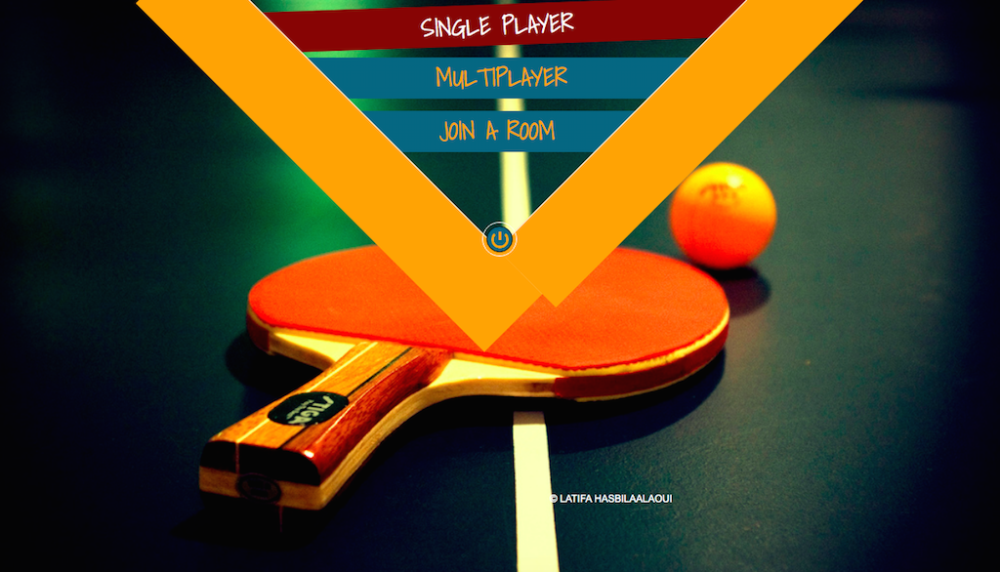
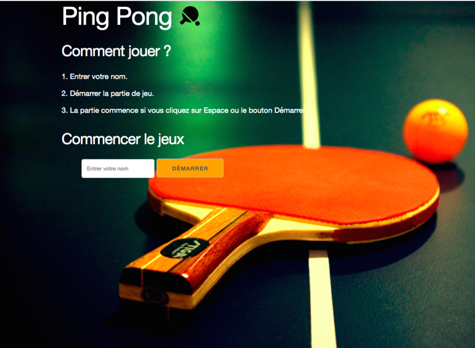
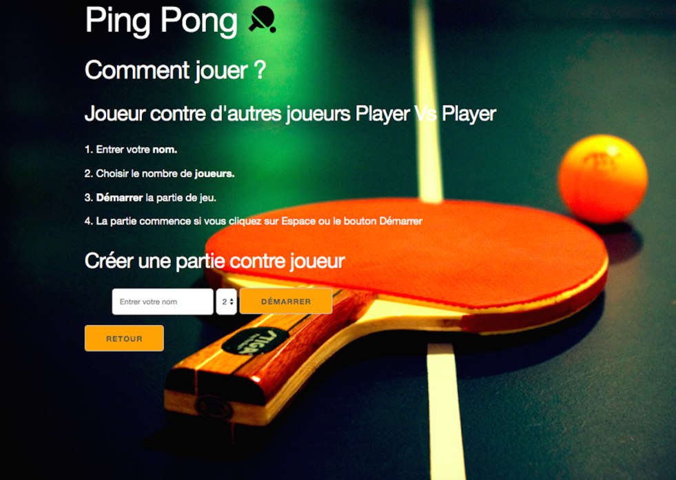
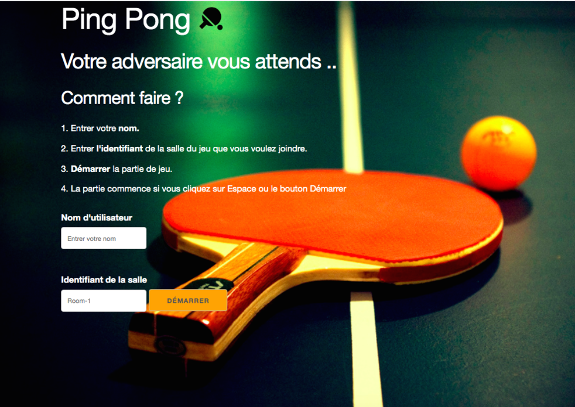
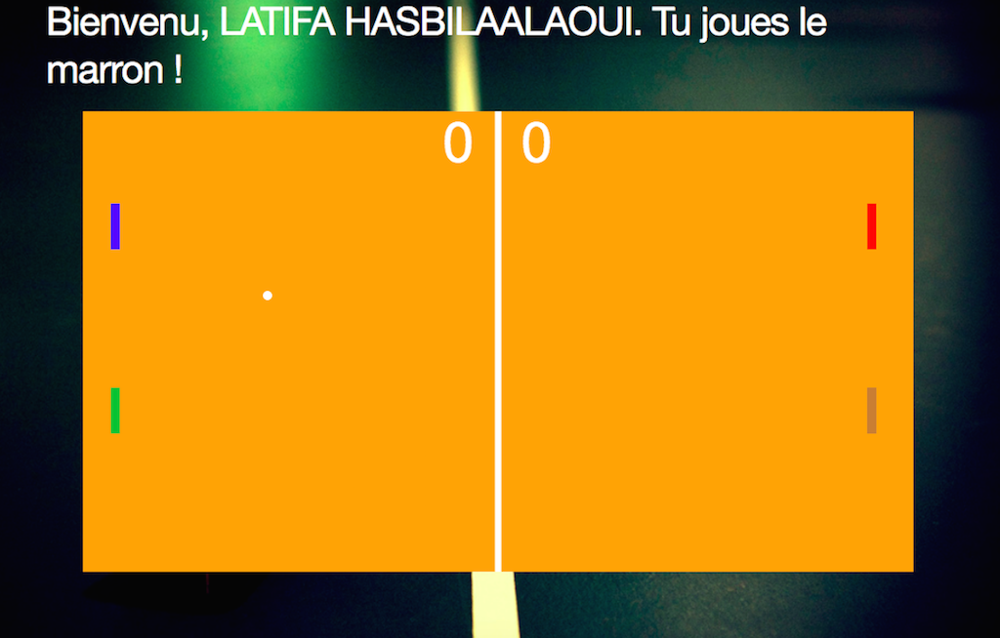

# JEU DE PING PONG

Il s'agit d'un jeu de ping-pong développé dans le cadre d'un projet universitaire avec des technologies récentes et de Intelligence artificielle & l'arbre de décision.

# I)- Les Technologies 
* HTML5 (Canvas)
* CSS3
* Node JS (Express JS)
* Socket.IO
* Tailwind

# II)- DEMARRER LE JEU : 

* Utilisé npm package manager :
[NODE JS](https://nodejs.org/en/download/)
<pre><code>
1. npm install
2. npm start
</code></pre>

* L'affichage dans votre navigateur ouvrez le :
[Localhost ](http://localhost:8080)

# III)- LES OPTIONS DU JEU : 
Vous avez un menu pour choisir si vous souhaiter jouer :
* Contre l'ordinateur IA à l'aide de la souris ou du clavier, option "SINGLE PLAYER".
* Contre d'autres joueurs en créant un jeu en ligne et de partager l'identifiant avec d'autre jouerus pour qu'ils puissent vous joindre : " MULTIPLAYER".
* Si vous voulez joindre vous amies dans le jeu ce qui nécessite un Identifiant.

## Étapes pour créer un jeu en ligne:

1. Créez une salle et choisissez le nombre de joueurs, 2 ou 4.
2. Autres joueurs: rejoignez la salle en donnant son identifiant.
3. Démarrez le jeu en entrant dans la barre d'espace ou en cliquant sur le bouton Démarrer.
4. Le gagnant est le premier à avoir 6 points.

# IV)- LES INTERFACES DU JEU :

*  **HOME/MENU du jeu :**

* **Pour un seul joueur ( SINGLE PLAYER ) :**

* **Pour multijoueurs ( MULTIPLAYERS ):**

* **Pour joindre un jeu en ligne ( JOIN ROOM ):**

 
* **L'interface de Terrain** :

**© LATIFA HASBILAALAOUI**
